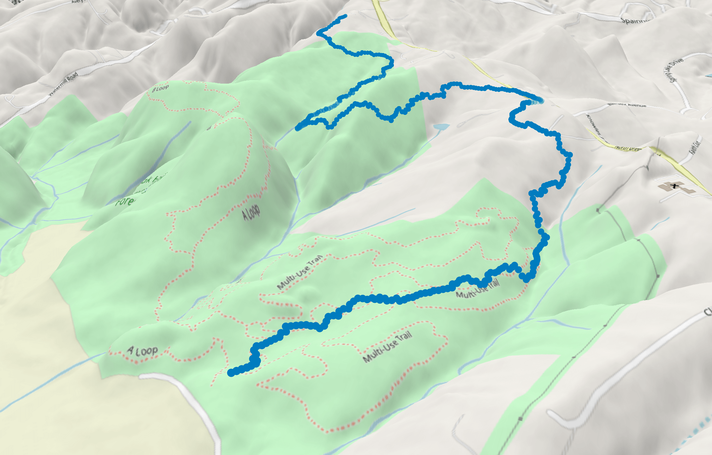
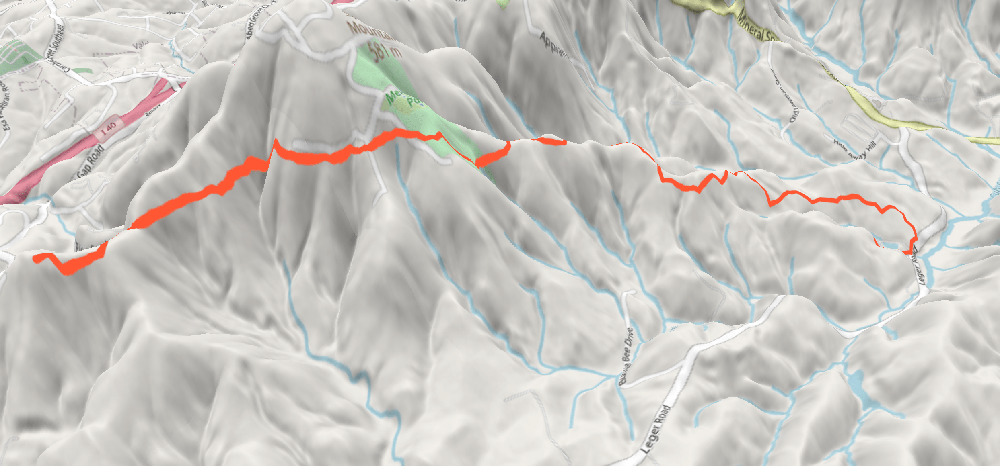

# TrailPathDesigner
Algorithm to create trail alignment. Considers horizontal turn angles, vertical slope and grade, mileage, proximity to other trails.
This algorithm can be visualized on [the Github Pages site for the repository](https://zakk-h.github.io/TrailPathDesigner/ "TrailPathDesigner").

## Overview

Trail Designer GeoPortal is a greedy pathfinding algorithm designed for trail creation on geographical terrains. This algorithm seeks to maximize trail mileage while adhering to constraints such as slope, grade, and turn angles. The algorithm dynamically generates paths based on elevation data, ensuring minimal slopes and optimal routing towards designated endpoints. It uses an internal compass that strengthens its directional bias as it progresses towards the endpoint, steering the trail in the right direction.

## Features

- **Slope Minimization:** The algorithm prioritizes paths with minimal slopes, ensuring easier and more accessible trails.
- **Internal Compass:** An internal compass guides the trail towards the endpoint, with its influence increasing as the path progresses.
- **Adaptive Heuristics:** Probabilities for selecting the next step are adjusted based on slope, direction, and proximity to the endpoint.
- **Avoidance of Overlapping Trails:** The algorithm restricts paths from getting too close to previously built trails, maintaining distinct and separate trails.
- **Visualization:** Integration with MapLibre GL for real-time trail visualization on geographical maps.

## Time Complexity

The time complexity of the Trail Designer GeoPortal algorithm in terms of the number of nodes is O(N^2). This is because for each point processed, the algorithm may need to check proximity against all previously visited points, resulting in a quadratic relationship. There are a fixed number of edges - a linear function of N.

### Potential Optimizations

- **Spatial Data Structures:** Utilizing spatial data structures like k-d trees can help reduce the complexity of proximity checks, potentially improving performance.

## Future Work

1. **Nested Algorithm:** Implement a nested algorithm to consider multiple steps ahead rather than just the immediate next step. The current implementation creates probabilities that are locally favorable but does not adequately consider future steps. A more forward-thinking approach could improve the overall quality and efficiency of the trails.

2. **Backtracking Mechanism:** Develop a robust backtracking mechanism. The current implementation lacks backtracking due to the complexity of determining the optimal point to backtrack to. This involves modeling decision points where the path starts to worsen, but it also needs to address situations where an initial wrong turn can set up the trail for failure. Effective backtracking would require understanding and quantifying when and where the decisions start to deteriorate. However, the current greedy approach is beneficial concerning runtime and has reasonable outputs for making local decisions.

3. **Lookahead Heuristics:** Implement heuristics that look farther ahead than just one step. This can help in making more informed decisions that consider the long-term impact of each move. By evaluating the potential future states, the algorithm can avoid paths that might lead to suboptimal or infeasible solutions later on.

4. **Brute Force Solution:** A brute force solution that evaluates all possible routes and ranks them based on a combination of lowest average slope and overall mileage may be worth the time complexity tradeoffs. This approach ensures that the algorithm doesn't just encourage winding around endlessly to achieve low slopes but also considers the practicality and efficiency of the trail. This may be suitable for scenarios where computation runtime speed is not a priority, and the user is primarily interested in finding the most optimal trail. This method can provide the highest quality trails by thoroughly exploring all possibilities and selecting the best one based on comprehensive criteria.

